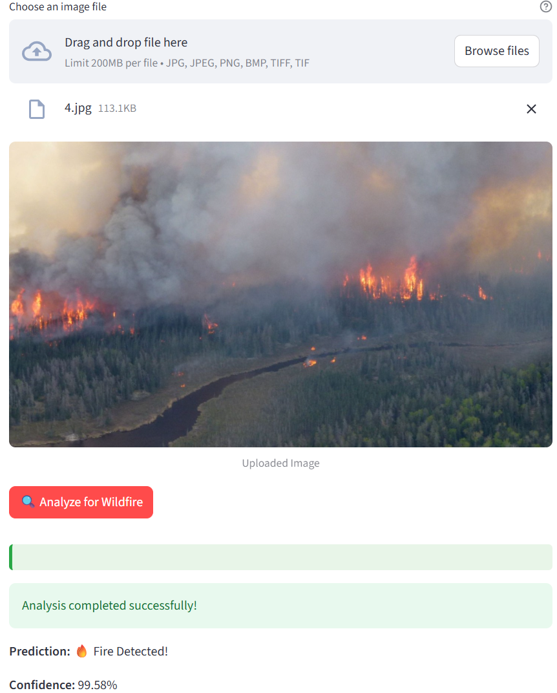
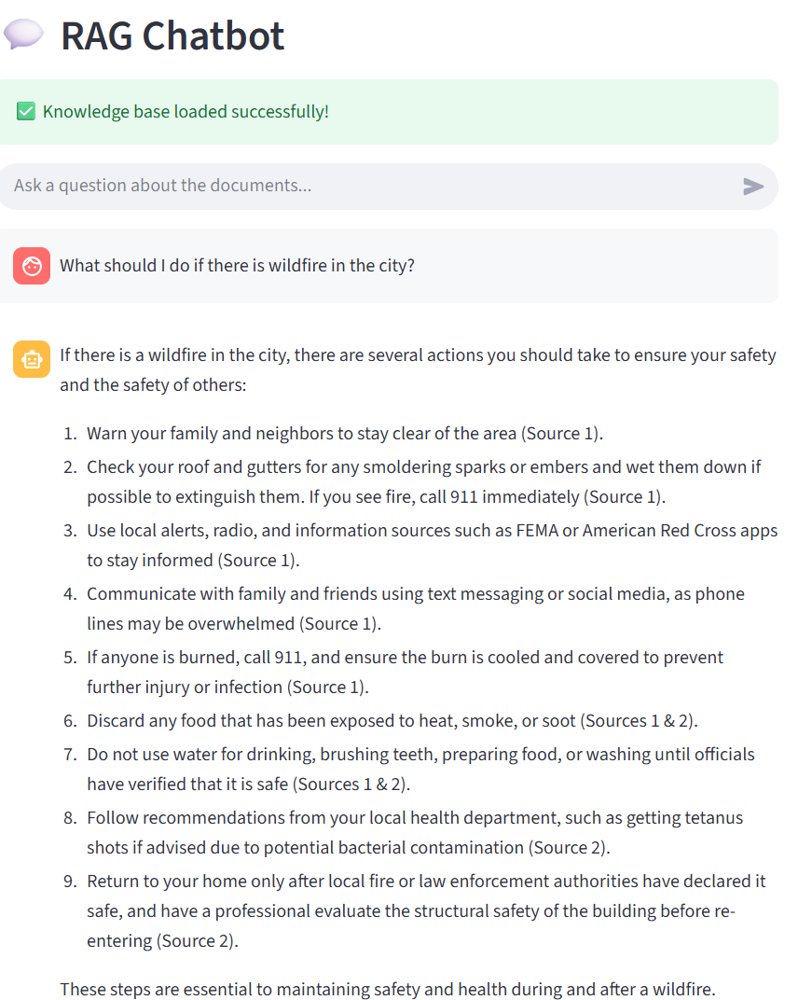

# Wildfire Image Detector & Chat Assistant 🔥💬

A deep learning project that combines **wildfire image classification** with a **chatbot-style interface** using RAG and GPT-4 for interactive wildfire information.

## 🔍 Objective

This project aims to:
- Detect whether an uploaded image shows signs of wildfire (fire/no_fire).
- Allow users to chat and ask questions related to wildfire safety, causes, prevention, etc.

It combines **Computer Vision** and **Natural Language Processing** to assist in wildfire detection and public education.

---

## 📂 Dataset

### 🔥 Image Classification
- Source: [Kaggle wildfire dataset](https://www.kaggle.com/datasets/brsdincer/wildfire-detection-image-data)
- Samples: ~1900 images (balanced classes: `fire` and `no_fire`)
- Format: RGB images of varying sizes

### 📄 RAG Document Corpus
- Sources: FEMA, UNICEF, and other public wildfire safety documents
- Processing:
  - Split into 200-word chunks
  - Embedded using OpenAI
  - Stored in vector FAISS DB
  - Retrieved using cosine similarity

You will find full list of documents with their original links below.

---

## 🧠 Methodology

### 1. 🔬 Image Classification
- **Baseline Model**: Custom CNN (ReLU, MaxPooling, Dropout)
- **Advanced Model**: EfficientNetB0 (transfer learning from ImageNet)
- **Evaluation**: Accuracy, Precision, Recall, F1-Score, Confusion Matrix
- **Tools**: PyTorch, torchvision, OpenCV

### 2. 🖥 Web Interface
- Framework: Streamlit
- Features:
  - Upload an image → Get fire/no_fire prediction
  - Textbox → Ask questions and get AI-generated answers

### 3. 🧾 Conversational Agent (RAG + GPT-4)
- Retrieval-Augmented Generation using LangChain
- Use cases:
  - Wildfire prevention tips
  - Climate and fire correlation
  - Document-based factual Q&A

---

## 🚀 Installation

To run this project locally:

### 🔹 1. Clone the repository

```bash
git clone https://github.com/ukhalilov/wildfire-detector.git
cd wildfire-detector
```
### 🔹 2. Install dependencies

Make sure you have Python 3.8+ installed. Then install required packages:

```bash
pip install streamlit torch torchvision Pillow python-dotenv langchain langchain-community langchain-openai faiss-cpu typing-extensions
```

### 🔹 3. Add Your own OPENAI API KEY

You need to create `.env` in the same directory and write your own OPENAI API KEY in the following way: `OPENAI_API_KEY=replace_this_with_your_key`

### 🔹 3. Run the application

Start the app using:

```bash
streamlit run wildfire_detector.py
```

---

## 🧪 How to Use the App

Once the app is running, here’s how to interact with it:

### 🔥 Left Side – Wildfire Detection

1. **Upload an Image** 
   On the left panel, click on **"Browse Files"** or Drag and drop files and upload a photo (formats supported: JPG, JPEG, PNG, BMP, TIFF, TIF). The maximum filesize of each image is 200MB.

2. **Preview Your Image**  
   After uploading, the image will appear below the upload button.

3. **Click "Analyze for Wildfire"**  
   Press the **"🔍 Analyze for Wildfire"** button under the image.  
   - If fire is detected: You’ll see **“🔥 Fire Detected!”**  
   - If not: You’ll see **“✅ No Fire Detected.”** 
   
   - A confidence score will also be shown.



### 💬 Right Side – Chat with AI (RAG Q&A)

1. **Ask a Question**  
   Use the chat input box to type your question. The AI will search wildfire-related documents for answers.

2. **Get a Response**  
   - If the question **is related to wildfires**, you’ll get a helpful response along with **document sources** (e.g., FEMA, UNICEF).
   - If the question **is not related**, it will reply:  
     _"I couldn't find relevant information in the documents to answer your question."_



---

## 📚 RAG Documents

- [FEMA Wildfire Safety](https://www.usfa.fema.gov/downloads/pdf/publications/fa-266.pdf)
- [UNICEF Wildfire Smoke Guide](https://www.unicef.org/media/156676/file/safe-from-wildfire-smoke.pdf.pdf)
- [Oregon Wildfire FAQs](https://www.oregon.gov/oha/ph/Preparedness/Prepare/Documents/OHA%208626%20Wildfire%20FAQs-v6c.pdf)
- [The Washington State Department of Natural Resources](https://www.dnr.wa.gov/publications/rp_fire_how_to_prepare_wildfire.pdf)
- [The Nature Conservancy](https://www.nature.org/content/dam/tnc/nature/en/documents/Wildfire_Resilience_Roadmap.pdf)
- [County of San Diego](https://www.sandiegocounty.gov/content/dam/sdc/deh/fhd/disaster/publications_firerecovery_whattodoafterawildfire.pdf)
- [Idaho State](https://gov.idaho.gov/wp-content/uploads/2024/08/2024-wildfire-report.pdf)

---

## 👥 Authors

- Dilrabo Khidirova 
- Abdumutalib Begmuratov  
- Ulugbek Khalilov